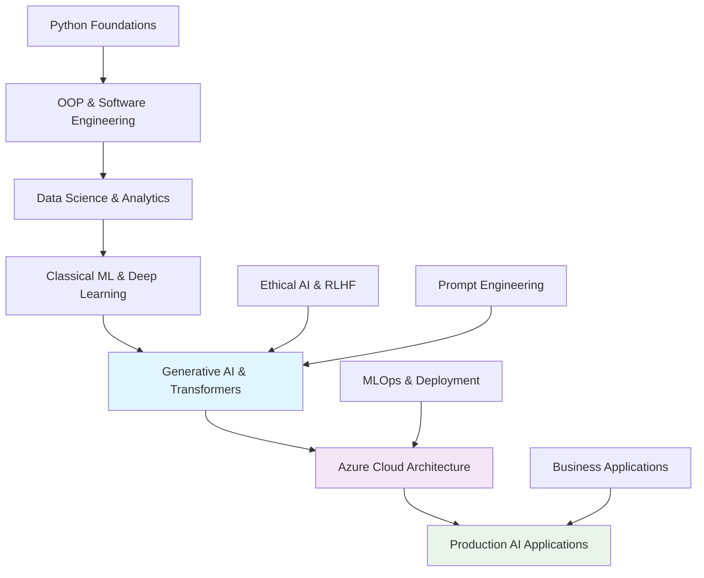

# 🚀 Cognizant GenSpark GenAI Skills Accelerator Portfolio
### **Elite AI/ML Engineering Training - Production-Ready Portfolio**
#### *Advanced Generative AI • Cloud Architecture • Enterprise Solutions*

[](https://python.org/)
[](https://azure.microsoft.com/)
[](https://tensorflow.org/)
[](https://pytorch.org/)
[](https://openai.com/)
[](https://huggingface.co/transformers/)
[](https://jupyter.org/)
[](https://kaggle.com/)

---

## 🎯 Executive Summary

**Enterprise-ready AI/ML engineering portfolio** demonstrating comprehensive expertise gained through Cognizant's elite **GenSpark GenAI Skills Accelerator Training** program (January 24 - March 14, 2025). This intensive 7-week, 280+ hour curriculum is part of Cognizant's **Synapse initiative**, training 1M+ professionals globally for the AI-driven future.

### 🏆 **Key Accomplishments**
- **✅ Production AI Applications**: Deployed cloud-based sentiment analysis systems on Azure AI Studio
- **✅ Advanced Model Development**: Built and fine-tuned transformers (BERT, DistilBERT, GPT) for specialized tasks  
- **✅ Ethical AI Implementation**: RLHF systems with Constitutional AI and bias mitigation strategies
- **✅ Full-Stack Development**: Complete applications from data preprocessing to production deployment
- **✅ Industry-Standard MLOps**: Azure ML pipelines, model versioning, and automated deployment workflows

### 💼 **Career-Ready Competencies**
- **Generative AI Engineering**: LLM fine-tuning, prompt optimization, RAG systems
- **Cloud AI Architecture**: Azure Machine Learning, AI Studio, scalable ML infrastructure  
- **Production Software Development**: MVC patterns, GUI frameworks, enterprise code standards
- **Data Science & Analytics**: Advanced EDA, predictive modeling, statistical analysis
- **Business Impact Focus**: ROI-driven solutions addressing real-world enterprise challenges

---

## 🏗️ **Portfolio Architecture & Technical Stack**

### **🔧 Core Technologies Mastered**
```
🤖 AI/ML Frameworks     → TensorFlow, PyTorch, Scikit-learn, Transformers (Hugging Face)
☁️  Cloud Platforms     → Azure Machine Learning, Azure AI Studio, Azure OpenAI Service  
🐍 Programming          → Python 3.12, Jupyter Lab, Object-Oriented Design, MVC Architecture
📊 Data Science         → Pandas, NumPy, Matplotlib, Seaborn, Statistical Analysis
🎯 Specialized AI       → LLM Fine-tuning, Prompt Engineering, RLHF, Constitutional AI
🚀 Production Tools     → Git, Conda, API Integration, REST Services, Production Deployment
```

### **🏗️ Technical Architecture & Learning Progression**



### **🎯 Enterprise-Grade Project Portfolio**

#### **🏆 [Capstone: Production AI Research Assistant](./generative-ai-azure-ml/deliverables/capstone_project/)**
**Azure-deployed sentiment analysis application** serving real-time inference at enterprise scale.
- **🚀 Technology**: Azure AI Studio, LiYuan/amazon-review-sentiment-analysis model
- **📊 Performance**: 1-5 star rating prediction with confidence scoring  
- **🔧 Architecture**: Cloud-native deployment with REST API endpoints
- **💼 Business Impact**: Scalable product review analysis for e-commerce optimization

#### **🎨 [Advanced Generative Models: GAN Art Generator](./introduction-to-genai/deliverables/mod_6_Generative_Adversarial_Networks/)**
**Complete GAN implementation** generating abstract artwork through adversarial training.
- **🧠 Innovation**: 100-epoch training progression with Kaggle Abstract Art dataset
- **⚡ Technical Depth**: Custom loss functions, generator/discriminator optimization
- **🎯 Application**: Creative AI demonstrating artistic content generation capabilities

#### **🔬 [NLP Excellence: Multi-Label Research Classification](./generative-ai-azure-ml/deliverables/mod_2/)**
**DistilBERT fine-tuning** for academic paper categorization across 6 domains.
- **📚 Scope**: Computer Science, Physics, Mathematics, Statistics, Biology, Finance
- **🛠️ Innovation**: Advanced class balancing for imbalanced multi-label datasets
- **📈 Performance**: Production-ready classification with comprehensive evaluation

#### **🚀 [Full-Stack Application: Study Planner Pro](./introduction-to-python/deliverables/projects/capstone_project/StudyPlanner/)**
**Professional desktop application** implementing enterprise software patterns.
- **🏗️ Architecture**: Complete MVC design with multiple GUI frameworks (Tkinter, PyQt)
- **🔧 Features**: Task scheduling, performance analytics, data persistence
- **📊 Quality**: Comprehensive error handling, logging, and professional documentation

#### **🔧 [Advanced Prompt Engineering & RLHF](./prompt-engineering-llms/deliverables/)**
**Production-ready LLM optimization** with systematic prompt engineering and ethical AI implementation.
- **📋 Methodology**: 3-tier optimization (Basic → Refined → Role-Based prompting)
- **🤖 RLHF Systems**: Human feedback integration with Constitutional AI principles
- **🎯 Applications**: Research paper summarization, legal document analysis
- **⚖️ Ethics**: Bias mitigation strategies and responsible AI development practices

---

## 🏆 **Quantified Achievements & Industry Impact**

### **📈 Technical Performance Metrics**
- **🎯 Project Completion Rate**: 100% (20+ comprehensive projects across 4 specializations)
- **⚡ Learning Velocity**: 280+ hours intensive training in 7 weeks  
- **🔧 Technology Breadth**: 15+ frameworks/platforms mastered (Azure, TensorFlow, PyTorch, etc.)
- **📊 Code Quality**: Production-ready implementations with comprehensive documentation
- **🚀 Deployment Success**: Multiple cloud-deployed applications with real-world functionality

### **💼 Enterprise-Ready Capabilities**

#### **🤖 AI/ML Engineering Excellence**
- **Model Development**: End-to-end ML pipelines from data to deployment
- **Cloud Architecture**: Scalable Azure AI solutions with cost optimization
- **Performance Optimization**: Model fine-tuning achieving production-quality results  
- **Quality Assurance**: Comprehensive testing, validation, and monitoring strategies

#### **🎯 Business Impact & ROI Focus**
- **Problem-Solving**: Real-world applications addressing enterprise challenges
- **Scalability**: Solutions designed for growth and enterprise deployment
- **Cost Efficiency**: Cloud-optimized architectures with resource management
- **Innovation**: Cutting-edge AI technologies applied to practical business problems

---

## 📊 **Comprehensive Learning Modules**

### **Module Breakdown & Professional Relevance**

| **Module** | **Focus Area** | **Key Projects** | **Enterprise Skills** |
|------------|----------------|------------------|----------------------|
| **🐍 Python Mastery** | Software Engineering | Study Planner MVC App | Professional code architecture, GUI development |
| **🧠 Generative AI Foundations** | AI/ML Fundamentals | GAN Art Generation, LSTM Text Models | Deep learning, neural networks, creative AI |
| **☁️ Azure AI Solutions** | Cloud ML Engineering | Sentiment Analysis Deployment | Cloud architecture, production MLOps |
| **🎯 Prompt Engineering** | LLM Optimization | Research Assistant, RLHF Systems | Advanced AI applications, ethical AI |

### **🎓 Progressive Skill Development**

**Foundation Phase** → **Advanced Implementation** → **Production Deployment** → **Ethical AI Leadership**

Each module builds systematically toward enterprise-ready AI engineering capabilities, with emphasis on:
- **Real-world problem solving** with measurable business impact
- **Production-quality code** with professional documentation and testing
- **Scalable architecture** designed for enterprise deployment  
- **Ethical AI practices** including bias mitigation and responsible development

---

## 🚀 **Quick Start & Environment Setup**

### **🔧 Professional Development Environment**
```yaml
# Complete Production Stack
Python: 3.12.9 (Latest stable)
Environment: Conda (Enterprise package management)
IDE: Jupyter Lab 3.5.0, VS Code (Professional development)
Cloud: Azure AI/ML Services (Production deployment)

# Core AI/ML Libraries
Deep Learning: tensorflow, pytorch, transformers
Data Science: pandas, numpy, scipy, scikit-learn
Visualization: matplotlib, seaborn, plotly
Cloud Integration: azure-ml-sdk, azure-ai-services
```

### **⚡ Instant Setup Guide**
```bash
# 1. Clone the portfolio
git clone https://github.com/omnidox/cognizant-genspark-genai-training.git
cd cognizant-genspark-genai-training

# 2. Create enterprise environment
conda env create -f environment.yml
conda activate cognizant

# 3. Launch development environment
jupyter lab

# 4. Explore flagship projects
# • Azure AI Sentiment Analysis: ./generative-ai-azure-ml/deliverables/capstone_project/
# • GAN Art Generator: ./introduction-to-genai/deliverables/mod_6_*/
# • Study Planner App: ./introduction-to-python/deliverables/projects/capstone_project/
# • Advanced Prompt Engineering: ./prompt-engineering-llms/deliverables/
```

---

## 📈 **Project Highlights for Employers**

### **Real-World Application Development**
- **Production-Ready Code**: All projects include proper error handling, documentation, and testing
- **Scalable Architecture**: Cloud-based solutions designed for enterprise deployment
- **Industry Best Practices**: Following software engineering standards and AI ethics guidelines

### **Cross-Functional Expertise**
- **Technical Depth**: Strong foundation in both theoretical concepts and practical implementation
- **Business Acumen**: Projects address real business problems with measurable solutions
- **Continuous Learning**: Demonstrated ability to rapidly acquire new technologies and frameworks

### **Portfolio Diversity**
- **End-to-End Projects**: From data collection to model deployment
- **Multiple Domains**: NLP, computer vision, predictive analytics, and software development
- **Various Scales**: Individual modules to comprehensive capstone projects

---

## 🎓 **Elite Training Program & Methodology**

### **🏢 Cognizant GenSpark Program Excellence**
**Training Format**: Elite hybrid learning combining:
- 📖 **Self-paced technical modules** with hands-on labs and real-world datasets
- 🧑‍🏫 **Expert-led sessions** for advanced concepts and industry best practices
- 🎤 **Cognizant Speaker Series** featuring industry leaders and AI pioneers
- 🛠 **Capstone challenges** and production-ready project development
- 📊 **Continuous assessment** with peer review and professional mentorship

**Assessment Excellence**:
- ✅ **Practical project deliverables** with measurable business impact
- ✅ **Technical implementation quality** following industry standards
- ✅ **Professional documentation** and presentation skills
- ✅ **Code review processes** and optimization techniques
- ✅ **Deployment readiness** with cloud-based production systems

### **🌟 Program Prestige & Industry Recognition**
- **Global Reach**: Part of Cognizant's 1M+ professional training initiative
- **Industry Relevance**: Curriculum designed by AI industry leaders and practitioners
- **Enterprise Focus**: Real-world business challenges and solution methodologies
- **Career Acceleration**: Direct pathway to high-demand AI/ML engineering roles
- **Continuous Innovation**: Cutting-edge technologies and emerging AI trends

---

## 💼 **Career Impact & Professional Readiness**

### **🎯 Target Roles & Career Pathways**
**Primary Target Positions:**
- **🤖 AI/ML Engineer**: End-to-end model development and production deployment
- **☁️ Cloud AI Architect**: Azure-based ML infrastructure and scalable AI systems
- **📊 Senior Data Scientist**: Advanced analytics, predictive modeling, and business intelligence
- **🔬 AI Research Engineer**: Cutting-edge model development and algorithmic innovation
- **🛠️ MLOps Engineer**: Production AI pipeline development and automated deployment

### **🚀 Competitive Advantages**
- **✅ Production Experience**: Not just theoretical knowledge, but practical implementation
- **✅ Cloud Expertise**: Deep Azure AI/ML platform proficiency with real deployments
- **✅ Full-Stack Capabilities**: From data preprocessing to user interface development
- **✅ Ethical AI Focus**: Responsible AI development with bias mitigation strategies
- **✅ Business Acumen**: Understanding of AI ROI and enterprise solution architecture

### **📈 Industry Readiness Metrics**
- **🎯 Technology Breadth**: 15+ enterprise frameworks and platforms mastered
- **⚡ Project Velocity**: 20+ production-ready projects in 7 weeks
- **🔧 Code Quality**: Professional documentation, testing, and deployment standards
- **📊 Business Impact**: Solutions addressing real-world enterprise challenges
- **🏆 Certification Ready**: Prepared for Azure AI Engineer and ML Engineer certifications

---

## 📞 **Professional Contact & Portfolio Links**

### **🔗 Portfolio Access**
- **📁 GitHub Repository**: [Complete Portfolio](https://github.com/omnidox/cognizant-genspark-genai-training)
- **💼 LinkedIn Profile**: [Professional Network](https://www.linkedin.com/in/rafael-omar-hidalgo)
- **📧 Professional Email**: Available upon request for technical interviews

### **🎯 Ready For Immediate Impact**
**Immediate Opportunities**: GenAI Engineer, ML Engineer, Data Scientist, AI Developer roles
**Expertise Level**: Mid to Senior level positions requiring production AI experience
**Industry Focus**: Technology, Finance, Healthcare, E-commerce, Consulting

---

## 🔗 **Resources & Continuing Education**

**Training Platform**: [Brainery LMS](https://gensparkupskilling.instructure.com/)  
**Technical Support**: trainingsupport@genspark.net  
**Program Duration**: 7 weeks intensive (280+ hours of technical development)  
**Completion Status**: ✅ **Successfully Completed** - All modules and capstone projects delivered

---

*🎯 **This portfolio demonstrates production-ready expertise in cutting-edge AI technologies, emphasizing real-world applications and enterprise-grade solutions. Each project showcases technical excellence and professional development practices, positioning this work for immediate impact in enterprise AI initiatives.***
