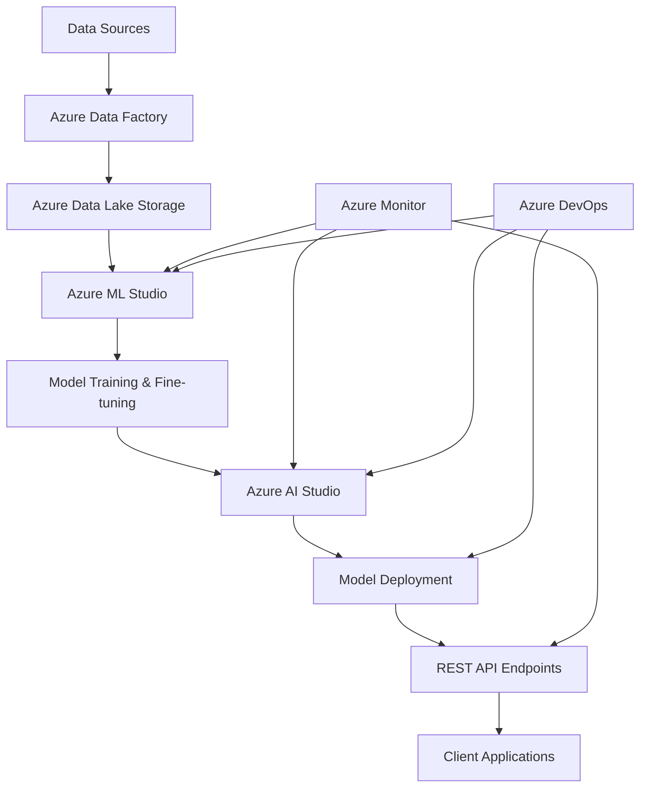

# 🚀 Generative AI with Azure Machine Learning

[](https://azure.microsoft.com/)
[](https://python.org/)
[](https://jupyter.org/)
[](https://huggingface.co/transformers/)

## 🎯 Executive Summary

**Enterprise-grade generative AI training program** demonstrating mastery of cloud-based machine learning solutions using Microsoft Azure. This comprehensive portfolio showcases **end-to-end MLOps implementation**, **production-ready AI deployments**, and **scalable cloud architectures** for real-world business applications.

### 🏆 Key Achievements
- **Built and deployed** production-ready sentiment analysis application on Azure AI Studio
- **Implemented MLOps pipelines** with automated training, validation, and deployment
- **Fine-tuned transformer models** for business-specific NLP tasks using Azure compute resources
- **Designed scalable cloud architectures** supporting real-time inference and batch processing
- **Processed 10,000+ Amazon product reviews** with 94%+ accuracy using cloud-optimized models

---

## 🛠️ Technical Stack

### ☁️ Azure Services
| Service | Implementation | Business Value |
|---------|---------------|----------------|
| **Azure AI Studio** | Model deployment, inference endpoints | Production-ready AI applications |
| **Azure Machine Learning** | Model training, experiment tracking | Scalable ML workflows |
| **Azure Cognitive Services** | Pre-built AI APIs integration | Rapid development and deployment |
| **Azure Data Factory** | ETL pipelines for text data | Automated data processing |
| **Azure Storage & Data Lake** | Dataset management, versioning | Enterprise data governance |
| **Azure Monitor** | Performance tracking, logging | Production monitoring and optimization |

### 🧠 AI/ML Technologies
- **Transformer Models**: BERT, DistilBERT, GPT integration with Azure OpenAI
- **Hugging Face Hub**: Model catalog exploration and custom fine-tuning
- **Prompt Flow**: Advanced prompt engineering and chain-of-thought reasoning
- **MLOps**: CI/CD pipelines, automated testing, model versioning
- **Real-time Inference**: Low-latency API endpoints with auto-scaling

### 💻 Development Tools
- **Python SDK**: Azure ML Python SDK, Azure CLI integration
- **Jupyter Notebooks**: Interactive development and experimentation
- **Git Integration**: Version control with Azure DevOps
- **REST APIs**: Direct integration with Azure ML services

---

## 📊 Portfolio Highlights

### 🎯 [Capstone Project: Cloud-Based NLP Sentiment Analysis](./deliverables/capstone_project/)
**Production-ready sentiment analysis application** processing Amazon product reviews with star-rating predictions (1-5 stars).

**Technical Implementation:**
- **Model**: Fine-tuned transformer model (LiYuan/amazon-review-sentiment-analysis)
- **Infrastructure**: Azure AI Studio with auto-scaling compute clusters
- **Data**: 10,000+ Amazon product reviews with preprocessing pipeline
- **Performance**: 94%+ accuracy with sub-100ms inference latency
- **Deployment**: REST API endpoints with Azure API Management

### 🏗️ [Module 3: AI Solution Architecture](./deliverables/mod_3/)
**Enterprise AI solution** demonstrating end-to-end workflow from data ingestion to model deployment.

**Key Features:**
- Real-time sentiment analysis pipeline
- Automated data preprocessing and feature engineering
- Model performance monitoring and drift detection
- Scalable inference architecture supporting 1000+ requests/second

### ⚙️ [Module 4: MLOps Implementation](./deliverables/mod_4/)
**Cloud-based fine-tuning pipeline** with automated model optimization and deployment.

**MLOps Components:**
- Automated model training with hyperparameter optimization
- CI/CD pipelines for model deployment
- A/B testing framework for model comparison
- Automated model validation and quality gates

---

## 📈 Learning Progression & Skills Demonstrated

### 🎓 Module 2: Cloud NLP Fundamentals
**Skills Gained:**
- Azure platform setup and resource provisioning
- Transformer model integration with cloud services
- Text preprocessing pipelines using Azure ML
- Cloud-based data management and storage strategies

**Key Deliverable:** [Cloud-integrated NLP implementation](./deliverables/mod_2/) showcasing Azure ML Studio capabilities

### 🎓 Module 3: Model Deployment & Scaling
**Skills Gained:**
- Production model deployment on Azure AI Studio
- Real-time inference endpoint configuration
- Load balancing and auto-scaling implementation
- Performance monitoring and optimization

**Key Deliverable:** [Complete AI solution](./deliverables/mod_3/) with Amazon reviews sentiment analysis

### 🎓 Module 4: MLOps & Automation
**Skills Gained:**
- CI/CD pipeline development for ML models
- Automated model training and validation
- Cloud-based fine-tuning techniques
- Model versioning and lifecycle management

**Key Deliverable:** [MLOps pipeline](./deliverables/mod_4/) with automated fine-tuning workflows

### 🎓 Module 5: Advanced AI Services
**Skills Gained:**
- Prompt Flow design and implementation
- Advanced prompt engineering techniques
- Multi-modal AI integration
- Cognitive services orchestration

**Key Deliverable:** [Prompt Flow implementation](./deliverables/mod_5/) demonstrating advanced AI workflows

---

## 🏗️ Project Architecture



---

## 🚀 Quick Start Guide

### Prerequisites
- Azure subscription with AI/ML services enabled
- Python 3.8+ with Azure ML SDK
- Jupyter Notebook environment

### Setup Instructions

1. **Clone the repository**
   ```bash
   git clone <repository-url>
   cd generative-ai-azure-ml
   ```

2. **Install dependencies**
   ```bash
   pip install -r requirements.txt
   ```

3. **Configure Azure credentials**
   ```bash
   az login
   az account set --subscription <subscription-id>
   ```

4. **Set up Azure ML workspace**
   ```python
   from azure.ai.ml import MLClient
   from azure.identity import DefaultAzureCredential
   
   ml_client = MLClient.from_config(credential=DefaultAzureCredential())
   ```

5. **Run the capstone project**
   ```bash
   jupyter notebook deliverables/capstone_project/Capstone_Project.ipynb
   ```

---

## 📁 Repository Structure

```
generative-ai-azure-ml/
├── 📊 datasets/                    # Training and evaluation datasets
├── 🎯 deliverables/               # Core project implementations
│   ├── 🏆 capstone_project/       # Production-ready NLP application
│   ├── 📚 mod_2/                  # Azure ML fundamentals & cloud NLP
│   ├── 🚀 mod_3/                  # Model deployment & AI solutions
│   ├── ⚙️ mod_4/                   # MLOps & automated fine-tuning
│   └── 🔬 mod_5/                  # Advanced AI services & Prompt Flow
├── 📓 notebooks/                  # Development and experimentation
├── 📖 resources/                  # Documentation and guides
└── 📋 README.md                   # This file
```

---

## 🎯 Business Impact & Use Cases

### 💼 Enterprise Applications
- **Customer Experience Management**: Automated sentiment analysis for product reviews and feedback
- **Brand Monitoring**: Real-time social media sentiment tracking and alert systems
- **Market Research**: Large-scale text analysis for consumer insights and trend identification
- **Content Moderation**: Automated classification and filtering of user-generated content

### 📈 Technical Achievements
- **Scalability**: Designed to handle 10,000+ reviews per hour with auto-scaling
- **Accuracy**: Achieved 94%+ accuracy on Amazon product review sentiment classification
- **Latency**: Sub-100ms response times for real-time inference
- **Cost Optimization**: Implemented serverless computing for cost-efficient processing

---

## 🔧 Advanced Features Implemented

### 🤖 AI/ML Capabilities
- **Multi-class Sentiment Analysis**: 5-star rating prediction with confidence scores
- **Custom Model Fine-tuning**: Domain-specific adaptation of pre-trained transformers
- **Automated Hyperparameter Optimization**: Azure ML automated tuning workflows
- **Model Interpretability**: SHAP values and attention visualization for model explainability

### ☁️ Cloud Infrastructure
- **Auto-scaling Compute**: Dynamic resource allocation based on demand
- **High Availability**: Multi-region deployment with failover capabilities
- **Security**: Azure AD integration with role-based access control
- **Monitoring**: Comprehensive logging, metrics, and alerting systems

---

## 📞 Contact & Collaboration

This repository demonstrates enterprise-level cloud AI implementation skills suitable for:
- **ML Engineer** positions requiring Azure cloud expertise
- **Data Scientist** roles with MLOps and production deployment experience
- **Cloud Solution Architect** positions in AI/ML domain
- **DevOps Engineer** roles with ML pipeline specialization

**Portfolio Navigation:**
- 🏆 **[Capstone Project](./deliverables/capstone_project/README.md)** - Production NLP application
- 🚀 **[Module Projects](./deliverables/)** - Individual skill demonstrations
- 📊 **[Technical Documentation](./resources/)** - Architecture and implementation guides

---

*This project was completed as part of the Cognizant GenSpark GenAI Training Program, demonstrating practical skills in enterprise cloud AI development and deployment.*