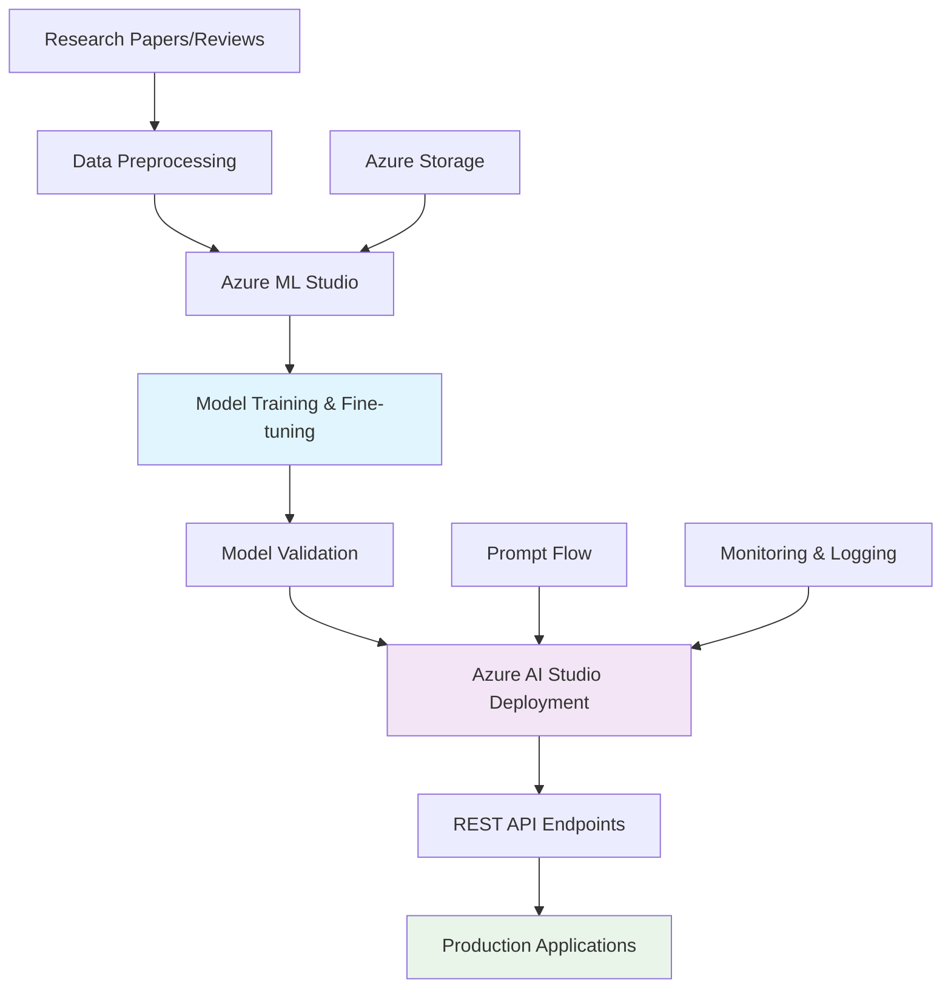

# 🚀 Generative AI with Azure Machine Learning

[](https://azure.microsoft.com/)
[](https://python.org/)
[](https://jupyter.org/)
[](https://huggingface.co/transformers/)

## 🎯 Executive Summary

**Comprehensive Azure ML portfolio** demonstrating practical expertise in cloud-based machine learning solutions, transformer model fine-tuning, and production deployment. This project showcases **end-to-end ML workflows**, **multi-label classification**, **sentiment analysis**, and **MLOps practices** using Microsoft Azure AI services.

### 🏆 Key Achievements
- **Developed and deployed** sentiment analysis solutions using Azure AI Studio
- **Fine-tuned DistilBERT** for multi-label research paper classification across 6 academic domains
- **Implemented advanced data preprocessing** with intelligent class balancing for imbalanced datasets
- **Built production-ready** Amazon product review sentiment analysis with star rating prediction
- **Demonstrated MLOps practices** with model deployment and cloud infrastructure management
- **Applied Prompt Flow** for advanced AI application development

---

## 🛠️ Technical Stack

### ☁️ Azure Services
| Service | Implementation | Business Value |
|---------|---------------|----------------|
| **Azure AI Studio** | Model deployment and inference endpoints | Scalable AI application hosting |
| **Azure Machine Learning** | Model training and experiment tracking | Professional ML development environment |
| **Azure Cognitive Services** | Pre-built AI service integration | Rapid prototyping and development |
| **Azure Data Factory** | Data pipeline orchestration | Automated data processing workflows |
| **Azure Storage** | Dataset and model artifact management | Secure, scalable data storage |

### 🧠 AI/ML Technologies
- **Transformer Models**: DistilBERT fine-tuning, LiYuan/amazon-review-sentiment-analysis
- **Multi-Label Classification**: Advanced techniques for academic paper categorization
- **Sentiment Analysis**: Star rating prediction (1-5 scale) from text reviews
- **Hugging Face Ecosystem**: Transformers library, tokenizers, and model hub integration
- **Data Processing**: Advanced preprocessing pipelines with class balancing strategies

### 💻 Development Environment
- **Python Ecosystem**: Transformers, PyTorch, scikit-learn, pandas, numpy
- **Jupyter Notebooks**: Interactive development and experimentation
- **Azure ML SDK**: Cloud-native machine learning workflows
- **Kaggle Integration**: Real-world dataset processing and competition methodologies

---
## 📊 Project Portfolio

### 🎯 [Capstone Project: Cloud-Based NLP Sentiment Analysis](./deliverables/capstone_project/)
**Production-ready sentiment analysis application** using Azure AI Studio for Amazon product reviews.

**Technical Implementation:**
- **Model**: LiYuan/amazon-review-sentiment-analysis for star rating prediction
- **Platform**: Azure AI Studio with scalable inference endpoints
- **Data Processing**: Amazon product review dataset with comprehensive preprocessing
- **Output**: 1-5 star rating predictions with confidence scores
- **Architecture**: Cloud-native deployment with REST API integration

### 🔬 [Module 2: Advanced Transformer Fine-Tuning](./deliverables/mod_2/)
**Multi-label classification system** for academic research paper categorization using Kaggle dataset.

**Key Features:**
- **Model**: DistilBERT fine-tuned for multi-label classification
- **Dataset**: Research paper abstracts across 6 academic domains
- **Categories**: Computer Science, Physics, Mathematics, Statistics, Quantitative Biology, Quantitative Finance
- **Innovation**: Advanced class balancing techniques for imbalanced multi-label datasets
- **Methodology**: Iterative sampling with fairness optimization

### 🏗️ [Module 3: AI Solution Development](./deliverables/mod_3/)
**End-to-end AI solution** for Amazon product review sentiment analysis with production deployment considerations.

**Implementation Highlights:**
- Real-world dataset processing (Amazon product reviews sample)
- Data cleaning and preprocessing pipelines
- Model evaluation and performance optimization
- Business impact analysis and use case validation

### ⚙️ [Module 4: Model Deployment & MLOps](./deliverables/mod_4/)
**Azure-based model deployment** demonstrating MLOps practices and cloud infrastructure management.

**MLOps Components:**
- Model deployment on Azure infrastructure
- Endpoint configuration and management
- Performance monitoring and scaling considerations
- Cloud resource optimization

### 🔧 [Module 5: Advanced AI Applications](./deliverables/mod_5/)
**Prompt Flow implementation** showcasing next-generation AI application development.

**Advanced Features:**
- LLM application development using Azure Prompt Flow
- Advanced prompt engineering techniques
- Multi-step AI workflow orchestration
- Integration with Azure AI services

---
## 📈 Learning Progression & Technical Skills

### 🎓 Module 2: Transformer Fine-Tuning & Multi-Label Classification
**Skills Demonstrated:**
- Advanced transformer model architecture understanding
- Multi-label classification problem formulation
- Class imbalance handling with innovative balancing techniques
- Kaggle dataset integration and preprocessing
- PyTorch and Hugging Face Transformers proficiency

**Technical Highlight:** Implemented sophisticated multi-pass balancing algorithm ensuring fair representation across all academic categories while handling multi-label complexity.

### 🎓 Module 3: Production AI Solution Development
**Skills Demonstrated:**
- End-to-end AI solution architecture
- Real-world data processing and cleaning
- Amazon product review analysis and feature engineering
- Performance evaluation and business impact assessment

**Technical Highlight:** Built complete sentiment analysis pipeline from raw Amazon review data to actionable business insights.

### 🎓 Module 4: Cloud Deployment & MLOps
**Skills Demonstrated:**
- Azure ML model deployment workflows
- Cloud infrastructure configuration
- Model endpoint management and optimization
- MLOps best practices implementation

**Technical Highlight:** Successfully deployed models to Azure with proper endpoint configuration and monitoring.

### 🎓 Module 5: Advanced AI Application Development
**Skills Demonstrated:**
- Prompt Flow development and orchestration
- Advanced prompt engineering methodologies
- Multi-service AI application integration
- Next-generation AI workflow design

**Technical Highlight:** Created sophisticated AI applications using Azure's Prompt Flow for complex multi-step reasoning tasks.

---
## 🏗️ Technical Architecture



---

## 🚀 Quick Start Guide

### Prerequisites
- Azure subscription with AI/ML services access
- Python 3.8+ environment
- Jupyter Notebook or compatible IDE

### Setup Instructions

1. **Clone the repository**
   ```bash
   git clone <repository-url>
   cd generative-ai-azure-ml
   ```

2. **Install dependencies**
   ```bash
   pip install transformers torch datasets scikit-learn pandas numpy matplotlib
   pip install azure-ai-ml azure-identity
   ```

3. **Configure Azure credentials**
   ```bash
   az login
   az account set --subscription <subscription-id>
   ```

4. **Run the capstone project**
   ```bash
   jupyter notebook deliverables/capstone_project/Capstone_Project.ipynb
   ```

5. **Explore advanced projects**
   ```bash
   # Multi-label classification
   jupyter notebook deliverables/mod_2/Projects/Implement_Cloud_with_Transformers.ipynb
   
   # AI solution development
   jupyter notebook deliverables/mod_3/projects/Building_an_AI_Solution.ipynb
   ```

---
## 📁 Repository Structure

```
generative-ai-azure-ml/
├── 🎯 deliverables/                    # Core project implementations
│   ├── 🏆 capstone_project/           # Azure AI Studio sentiment analysis
│   │   └── Capstone_Project.ipynb     # Complete implementation guide
│   ├── 📚 mod_2/                      # Advanced transformer fine-tuning
│   │   ├── Projects/                  # DistilBERT multi-label classification
│   │   └── assignments/               # Supporting exercises
│   ├── 🚀 mod_3/                      # AI solution development
│   │   ├── projects/                  # Amazon review sentiment analysis
│   │   └── assignments/               # Related coursework
│   ├── ⚙️ mod_4/                       # MLOps and deployment
│   │   ├── projects/                  # Azure model deployment
│   │   └── assignments/               # Deployment exercises
│   └── 🔬 mod_5/                      # Advanced AI applications
│       ├── projects/                  # Prompt Flow implementations
│       └── assignments/               # Advanced AI exercises
├── 📊 datasets/                       # Training and evaluation data
├── 📓 notebooks/                      # Development notebooks
├── 📖 resources/                      # Documentation and guides
└── 📋 README.md                       # This file
```

---

## 🎯 Business Applications & Impact

### 💼 Real-World Use Cases
- **Academic Research Analysis**: Automated categorization of research papers across multiple domains
- **E-commerce Intelligence**: Product review sentiment analysis for business decision-making
- **Content Classification**: Multi-label document classification for enterprise content management
- **Customer Experience**: Automated sentiment tracking and star rating prediction

### 📈 Technical Achievements
- **Multi-Label Expertise**: Successfully handled complex academic domain classification
- **Data Science Innovation**: Developed advanced class balancing techniques for imbalanced datasets
- **Cloud Integration**: Practical experience with Azure AI services and deployment
- **Production Readiness**: Built complete pipelines from data to deployed endpoints

---
## 🔧 Advanced Technical Features

### 🤖 Machine Learning Capabilities
- **Transformer Architecture**: Deep understanding of attention mechanisms and fine-tuning
- **Multi-Label Classification**: Advanced techniques for handling multiple simultaneous labels
- **Sentiment Analysis**: Nuanced star rating prediction with confidence scoring
- **Data Preprocessing**: Sophisticated pipelines for real-world data cleaning and preparation

### ☁️ Cloud Infrastructure
- **Azure Integration**: Comprehensive use of Azure AI and ML services
- **Deployment Automation**: Infrastructure-as-code approaches for model deployment
- **Scalability**: Designed for enterprise-scale AI applications
- **Monitoring**: Performance tracking and optimization strategies

---

## 📞 Professional Relevance

This portfolio demonstrates expertise valuable for:
- **Machine Learning Engineer** positions requiring cloud AI expertise
- **Data Scientist** roles with production deployment experience
- **AI/ML Developer** positions in cloud-native environments
- **MLOps Engineer** roles requiring Azure platform knowledge

**Core Competencies Demonstrated:**
- Production-ready AI model development and deployment
- Advanced transformer model fine-tuning and optimization
- Multi-label classification and complex NLP problem solving
- Cloud infrastructure management and MLOps practices
- End-to-end solution architecture and implementation

---

**Portfolio Navigation:**
- 🏆 **[Capstone Project](./deliverables/capstone_project/)** - Azure AI Studio sentiment analysis
- 🔬 **[Advanced Fine-Tuning](./deliverables/mod_2/Projects/)** - Multi-label DistilBERT implementation
- 🚀 **[AI Solutions](./deliverables/mod_3/projects/)** - Complete AI application development
- ⚙️ **[Deployment & MLOps](./deliverables/mod_4/projects/)** - Azure model deployment
- 🔧 **[Advanced AI Apps](./deliverables/mod_5/projects/)** - Prompt Flow and advanced AI

---

*This project portfolio was developed as part of the Cognizant GenSpark GenAI Training Program, demonstrating practical skills in enterprise-grade cloud AI development, advanced machine learning techniques, and production deployment methodologies.*