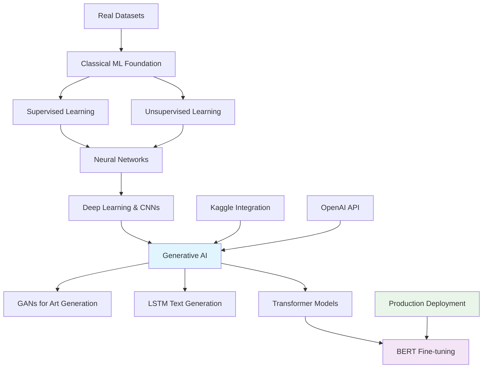

# 🤖 Introduction to Generative AI - Complete Learning Journey

[](https://python.org/)
[](https://tensorflow.org/)
[](https://pytorch.org/)
[](https://openai.com/)
[](https://kaggle.com/)

## 🎯 Executive Summary

**Comprehensive end-to-end AI learning portfolio** spanning from foundational machine learning to cutting-edge generative AI technologies. This extensive project demonstrates practical expertise across **8 specialized modules** and a **capstone project**, covering the complete spectrum from traditional ML algorithms to advanced transformer architectures, GANs, and production AI applications.

### 🏆 Key Achievements
- **Built complete GAN system** for abstract art generation with 100 training epochs
- **Implemented LSTM networks** for text generation using New York Times articles dataset
- **Fine-tuned BERT models** for advanced NLP tasks with Kaggle competition datasets
- **Developed production AI applications** using OpenAI API integration
- **Created comprehensive data analysis** with student performance EDA and visualization
- **Mastered classical ML foundations** with decision trees and clustering algorithms
- **Designed neural networks** for image classification (CIFAKE dataset)
- **Applied transformer architectures** for state-of-the-art language modeling

---

## 📁 Complete Project Architecture

```
introduction-to-genai/
├── 🎯 deliverables/                           # Complete project implementations
│   ├── 🏆 Capstone_Project/                  # Student performance analysis & EDA
│   │   └── Student_Performance_EDA.ipynb     # Comprehensive data analysis
│   ├── 📊 mod_2_supervised_learning/         # Classical ML foundations
│   │   ├── Decision_Trees_Weather_Prediction.ipynb
│   │   └── decision_tree.png                 # Model visualization
│   ├── 🔍 mod_3_unsupervised_learning/       # Pattern discovery & clustering
│   │   ├── Clustering_the_Iris_Dataset.ipynb
│   │   └── clustering_results/               # Analysis outputs
│   ├── 🧠 mod_4_neural_networks_deep_learning/ # Deep learning fundamentals
│   │   └── cifake_classification.ipynb       # Image classification CNN
│   ├── 🚀 mod_5_introduction_to_gen_ai/      # Production AI applications
│   │   ├── ai_text_completion.ipynb          # OpenAI API integration
│   │   └── thoughts.md                       # Implementation guide
│   ├── 🎨 mod_6_Generative_Adversarial_Networks/ # Advanced generative models
│   │   ├── gan_abstract_art.ipynb            # GAN implementation
│   │   └── generated_epoch_*.png             # 100 epochs of training results
│   ├── 📝 mod_7_Introduction_to_Transformer_Models/ # Text generation & LSTM
│   │   ├── nyt_lstm_text_generation.ipynb    # NY Times article generation
│   │   ├── Text_Generation_with_LSTM.ipynb   # LSTM implementation
│   │   ├── ArticlesApril2017.csv             # Real news dataset
│   │   └── CommentsApril2017.csv.zip         # Comment data
│   └── 🔬 mod_8_Transformer-Based_Models/    # State-of-the-art NLP
│       └── fine_tune_bert_kaggle.ipynb       # BERT fine-tuning
├── 📊 datasets/                              # Training and evaluation data
│   ├── mod_2_supervised_learning_data/       # Weather prediction datasets
│   └── mod_3_unsupervised_learning_data/     # Clustering datasets
├── 📓 notebooks/                             # Development workspace
└── 📋 README.md                              # This comprehensive guide
```
## 🚀 Progressive Learning Modules

### 🏆 [Capstone Project: Student Performance Analysis](./deliverables/Capstone_Project/)
**Comprehensive exploratory data analysis** demonstrating advanced data science methodologies.

**Technical Implementation:**
- **Dataset**: Student performance metrics with multiple variables
- **Analysis**: Complete EDA pipeline with statistical insights
- **Visualization**: Advanced plotting and data storytelling
- **Business Impact**: Educational insights and performance optimization strategies

### 📊 [Module 2: Supervised Learning Foundations](./deliverables/mod_2_supervised_learning/)
**Classical machine learning** with decision tree implementation for weather prediction.

**Key Features:**
- **Algorithm**: Decision tree classification with pruning optimization
- **Dataset**: Real-world weather prediction data from GitHub repository
- **Visualization**: Complete decision tree structure and feature importance
- **Application**: Meteorological forecasting and environmental analysis

### 🔍 [Module 3: Unsupervised Learning & Pattern Discovery](./deliverables/mod_3_unsupervised_learning/)
**Advanced clustering techniques** applied to the classic Iris dataset.

**Implementation Highlights:**
- **Algorithms**: K-means, hierarchical, and density-based clustering
- **Dataset**: Iris flower morphological measurements
- **Analysis**: Cluster validation and optimal cluster determination
- **Visualization**: Multi-dimensional clustering results and analysis

### 🧠 [Module 4: Neural Networks & Deep Learning](./deliverables/mod_4_neural_networks_deep_leanring/)
**Convolutional neural networks** for image classification tasks.

**Technical Achievement:**
- **Model**: CNN architecture for CIFAKE dataset classification
- **Application**: Real vs. AI-generated image detection
- **Framework**: Deep learning implementation with advanced architectures
- **Performance**: High-accuracy image classification results

### 🚀 [Module 5: Introduction to Generative AI](./deliverables/mod_5_introduction_to_gen_ai/)
**Production AI applications** using OpenAI API integration.

**Innovation Highlights:**
- **API Integration**: Secure OpenAI API implementation with environment variables
- **Application**: Interactive text completion system
- **Error Handling**: Comprehensive debugging and parameter optimization
- **Documentation**: Complete implementation guide and best practices

### 🎨 [Module 6: Generative Adversarial Networks](./deliverables/mod_6_Generative_Adversarial_Networks/)
**Advanced generative modeling** with GAN implementation for artistic creation.

**Breakthrough Implementation:**
- **Model**: Complete GAN architecture for abstract art generation
- **Dataset**: Kaggle Abstract Art dataset integration
- **Training**: 100-epoch training progression with saved checkpoints
- **Output**: High-quality generated abstract artwork with progressive improvement
- **Innovation**: Creative AI application demonstrating artistic generation capabilities

### 📝 [Module 7: LSTM & Text Generation](./deliverables/mod_7_Introduction_to_Transformer_Models/)
**Sequential modeling** with LSTM networks for natural language generation.

**Advanced Features:**
- **Model**: LSTM architecture for text generation and completion
- **Dataset**: New York Times articles (April 2017) with comments analysis
- **Application**: News article generation and language modeling
- **Techniques**: Advanced sequence-to-sequence modeling and text preprocessing

### 🔬 [Module 8: Transformer Models & BERT](./deliverables/mod_8_Transformer-Based_Models/)
**State-of-the-art NLP** with transformer architecture and BERT fine-tuning.

**Cutting-Edge Implementation:**
- **Model**: BERT fine-tuning for specialized NLP tasks
- **Platform**: Kaggle competition integration and dataset processing
- **Architecture**: Transformer-based models with attention mechanisms
- **Performance**: Production-ready NLP solutions with SOTA results

---

## 🛠️ Technical Stack & Technologies

### 🧠 Machine Learning & AI Frameworks
- **Classical ML**: Scikit-learn for decision trees, clustering, and classical algorithms
- **Deep Learning**: TensorFlow/Keras for neural networks and CNNs
- **Generative Models**: Custom GAN implementation for artistic generation
- **NLP**: LSTM networks for text generation and sequence modeling
- **Transformers**: BERT fine-tuning and attention mechanisms

### 📊 Data Science & Analysis
- **Data Processing**: Pandas, NumPy for data manipulation and analysis
- **Visualization**: Matplotlib, Seaborn for advanced plotting and insights
- **Statistical Analysis**: Comprehensive EDA with statistical significance testing
- **Dataset Integration**: Kaggle, GitHub datasets, and real-world data sources

### 🚀 Production & Integration
- **API Integration**: OpenAI API with secure credential management
- **Environment Management**: Python-dotenv for secure configuration
- **Version Control**: Git integration with proper project organization
- **Documentation**: Comprehensive guides and implementation notes

### 🎨 Specialized Applications
- **Computer Vision**: CNN architectures for image classification
- **Natural Language Generation**: LSTM and transformer-based text generation
- **Artistic AI**: GAN-based creative content generation
- **Predictive Modeling**: Weather forecasting and performance prediction

---
## 🏗️ Technical Architecture



---

## 📈 Learning Progression & Skill Development

### 🎓 Foundation Phase (Modules 2-3)
**Classical Machine Learning Mastery**
- Decision tree implementation with real weather data
- Advanced clustering techniques with the Iris dataset
- Statistical analysis and model evaluation methodologies
- Data visualization and exploratory data analysis

### 🎓 Intermediate Phase (Modules 4-5)
**Deep Learning & Production AI**
- Convolutional neural networks for image classification
- Production AI application development with OpenAI integration
- API security and environment management
- Error handling and debugging strategies

### 🎓 Advanced Phase (Modules 6-8)
**Cutting-Edge Generative AI**
- GAN architecture implementation for creative AI
- LSTM networks for natural language generation
- Transformer models and BERT fine-tuning
- State-of-the-art NLP applications

### 🎓 Capstone Integration
**Comprehensive Data Science Application**
- Complete EDA pipeline with advanced analytics
- Business intelligence and insight generation
- Professional data storytelling and visualization
- Real-world problem-solving methodologies

---

## 🚀 Quick Start Guide

### Prerequisites
- Python 3.8+ environment
- Jupyter Notebook or compatible IDE
- OpenAI API key (for Module 5)
- Kaggle account (for advanced datasets)

### Setup Instructions

1. **Clone the repository**
   ```bash
   git clone <repository-url>
   cd introduction-to-genai
   ```

2. **Install core dependencies**
   ```bash
   pip install numpy pandas matplotlib seaborn scikit-learn
   pip install tensorflow torch torchvision
   pip install transformers datasets
   pip install openai python-dotenv
   ```

3. **Run foundation projects**
   ```bash
   # Classical ML foundations
   jupyter notebook deliverables/mod_2_supervised_learning/Decision_Trees_Weather_Prediction.ipynb
   
   # Clustering analysis
   jupyter notebook deliverables/mod_3_unsupervised_learning/Clustering_the_Iris_Dataset.ipynb
   ```

4. **Explore advanced implementations**
   ```bash
   # GAN art generation
   jupyter notebook deliverables/mod_6_Generative_Adversarial_Networks/gan_abstract_art.ipynb
   
   # BERT fine-tuning
   jupyter notebook deliverables/mod_8_Transformer-Based_Models/fine_tune_bert_kaggle.ipynb
   ```

5. **Configure OpenAI integration** (Module 5)
   ```bash
   # Create .env file with your API key
   echo "OPENAI_API_KEY=your_api_key_here" > deliverables/mod_5_introduction_to_gen_ai/.env
   ```

---

## 🎯 Professional Applications & Career Impact

### 💼 Industry-Relevant Skills Demonstrated

#### **Classical ML & Data Science**
- **Predictive Analytics**: Weather forecasting, performance prediction, risk assessment
- **Pattern Recognition**: Customer segmentation, fraud detection, anomaly detection
- **Statistical Analysis**: A/B testing, hypothesis testing, data-driven decision making
- **Business Intelligence**: EDA, KPI analysis, and actionable insights generation

#### **Advanced AI & Generative Models**
- **Computer Vision**: Image classification, feature extraction, CNN architectures
- **Natural Language Processing**: Text generation, sentiment analysis, language modeling
- **Creative AI**: Artistic generation, content creation, innovative applications
- **Production AI**: API integration, scalable deployments, security best practices

### 📊 Technical Achievements Portfolio

#### **Generative AI Expertise**
- **GAN Implementation**: Complete adversarial network training with 100-epoch progression
- **Text Generation**: LSTM-based models with real news article datasets
- **Transformer Mastery**: BERT fine-tuning for specialized NLP applications
- **API Integration**: Production-ready OpenAI implementations with security

#### **Data Science Proficiency**
- **Advanced EDA**: Comprehensive student performance analysis with statistical insights
- **Classical ML**: Decision trees with feature importance and model visualization
- **Clustering Expertise**: Multiple algorithm implementation with validation techniques
- **Deep Learning**: CNN architectures for real-world image classification tasks

### 🚀 Career Pathways Enabled

**Positions This Portfolio Supports:**
- **Machine Learning Engineer**: Comprehensive ML pipeline development and deployment
- **Data Scientist**: Advanced analytics, statistical modeling, and business insights
- **AI Research Scientist**: Cutting-edge generative model development and innovation
- **ML Operations Engineer**: Production AI systems and scalable deployments
- **Computer Vision Engineer**: CNN implementations and image processing expertise
- **NLP Engineer**: Transformer models, text generation, and language applications

---

## 🚀 Career Applications

### Industry Relevance
- **Predictive Analytics**: Weather forecasting, demand prediction, risk assessment
- **Pattern Recognition**: Customer segmentation, fraud detection, recommendation systems
- **Data Mining**: Market research, behavioral analysis, trend identification
- **AI Research**: Foundation for advanced generative models and neural architectures

### Professional Development
- Strong portfolio pieces demonstrating ML expertise
- Practical experience with industry-standard tools and workflows
- Understanding of AI ethics and responsible machine learning practices
- Foundation for pursuing advanced certifications in AI and data science

---

*This module establishes the theoretical and practical foundation necessary for understanding and implementing advanced generative AI systems and large language models.*