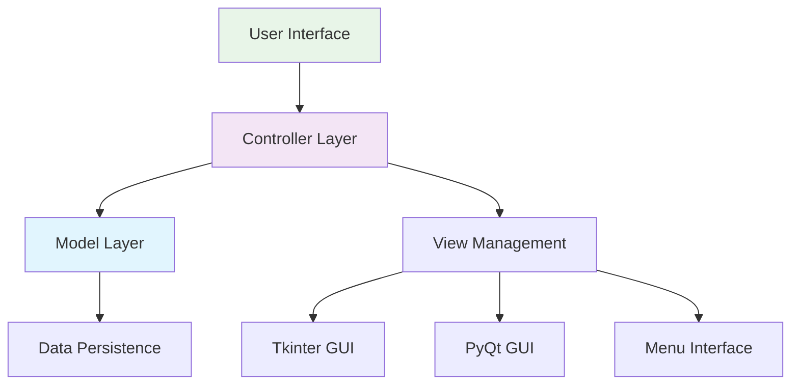

# 🐍 Introduction to Python Programming

[](https://python.org/)
[](https://jupyter.org/)
[](https://docs.python.org/3/library/tkinter.html)

## 📚 Overview

**Comprehensive Python programming foundation** demonstrating practical software development skills through hands-on projects and real-world applications. This module showcases **object-oriented design**, **GUI development**, **algorithmic thinking**, and **best practices** that are essential for professional software development and data science roles.

### 🏆 Key Achievements
- **Developed full-stack Study Planner application** with MVC architecture and multiple GUI frameworks
- **Implemented custom data structures** for inventory management and algorithm optimization
- **Built interactive games and utilities** demonstrating control flow and user experience design
- **Created robust error handling systems** with comprehensive exception management
- **Designed scalable software architecture** using design patterns and best practices
- **Demonstrated GUI proficiency** across Tkinter, PyQt, and menu-driven interfaces

## 🎯 Learning Objectives

- Master Python fundamentals including advanced data types, control structures, and functions
- Develop proficiency with object-oriented programming and design patterns
- Build practical GUI applications using multiple frameworks
- Implement custom algorithms and data structures from scratch
- Learn professional code organization, documentation, and testing practices
- Create complete software applications with real-world functionality

## 📁 Repository Structure

```
introduction-to-python/
├── 📚 deliverables/                   # Core project implementations
│   ├── 📋 assignments/               # Foundational programming exercises
│   │   ├── mod_1_Exploring_Python_Concepts.ipynb
│   │   ├── mod_2_Explore Loops in Python.ipynb
│   │   ├── mod_3_Exploring_String_Methods.ipynb
│   │   ├── mod_4_Hands_on_Python_Data_Structures.ipynb
│   │   ├── mod_5_About_Parameters_of_Functions.ipynb
│   │   └── mod_6_Check_your_Knowledge_on_Errors.ipynb
│   └── 🚀 projects/                  # Advanced application development
│       ├── 🏆 capstone_project/      # Full-stack Study Planner application
│       │   └── StudyPlanner/         # MVC architecture implementation
│       │       ├── main.py           # Application entry point
│       │       ├── model.py          # Data models and business logic
│       │       ├── controller.py     # Application controller
│       │       └── views/            # Multiple GUI implementations
│       │           ├── menu_view.py
│       │           ├── tkinter_view.py
│       │           ├── pyqt_view.py
│       │           └── performance_tracking_view.py
│       ├── mod_1_Eligible Elector.ipynb      # Voting eligibility system
│       ├── mod_2_Number Guessing Game.ipynb  # Interactive gaming logic
│       ├── mod_3_Password_Strength_Checker.ipynb  # Security validation
│       ├── mod_4_Implement_Your_own_Data_Structures.ipynb  # Custom algorithms
│       ├── mod_5_About_Menu_functioning.ipynb      # Menu-driven programming
│       ├── mod_6_Calculator_with_Exception_Handling.ipynb  # Error management
│       └── fractal.py                # Recursive graphics programming
├── 📊 datasets/                      # Sample data for practical exercises
├── 📓 notebooks/                     # Development and experimentation
└── 📖 resources/                     # Documentation and references
```

## 🔧 Technologies & Technical Stack

### Core Programming
- **Python 3.8+**: Advanced language features and modern syntax
- **Object-Oriented Programming**: Classes, inheritance, polymorphism, design patterns
- **Functional Programming**: Lambda functions, decorators, generators
- **Exception Handling**: Comprehensive error management and logging

### GUI Development
- **Tkinter**: Native Python GUI framework for desktop applications
- **PyQt**: Professional cross-platform GUI development
- **Menu-driven Interfaces**: Console-based user interaction systems
- **Multi-view Architecture**: Separation of concerns in UI design

### Software Engineering
- **MVC Architecture**: Model-View-Controller design pattern implementation
- **Singleton Pattern**: Centralized state management
- **Logging Systems**: Professional debugging and monitoring
- **Code Documentation**: Professional commenting and docstring practices

### Algorithm Implementation
- **Custom Data Structures**: Stack, queue, and tree implementations
- **Recursive Programming**: Fractal generation and tree traversal
- **Search and Validation**: Pattern matching and input verification
- **Performance Optimization**: Efficient algorithm design and analysis
---

## 🚀 Project Portfolio

### 🏆 [Capstone Project: Study Planner Application](./deliverables/projects/capstone_project/StudyPlanner/)
**Full-stack desktop application** implementing comprehensive task management with multiple GUI frameworks.

**Technical Implementation:**
- **Architecture**: Model-View-Controller (MVC) design pattern
- **Backend**: Singleton pattern for state management with persistent data storage
- **Frontend**: Multiple GUI implementations (Tkinter, PyQt, menu-driven)
- **Features**: Task scheduling, priority management, performance tracking, deadline validation
- **Logging**: Professional logging system with file-based persistence
- **Error Handling**: Comprehensive input validation and exception management

**Key Components:**
- **Model Layer**: Data validation, business logic, and persistence
- **Controller Layer**: Input processing and workflow coordination  
- **View Layer**: Multi-framework GUI implementation with seamless switching
- **Utilities**: Date validation, priority scoring, and performance analytics

### 🎮 [Interactive Gaming Applications](./deliverables/projects/)
**Collection of engaging applications** demonstrating control flow, user interaction, and algorithm implementation.

**Featured Projects:**
- **Number Guessing Game**: Random number generation with intelligent feedback loops
- **Password Strength Checker**: Security validation with comprehensive criteria analysis
- **Eligible Elector System**: Voting eligibility determination with data validation
- **Advanced Calculator**: Mathematical operations with robust exception handling

### 🔧 [Custom Data Structure Implementations](./deliverables/projects/mod_4_Implement_Your_own_Data_Structures.ipynb)
**From-scratch algorithm implementations** showcasing deep understanding of computer science fundamentals.

**Implementation Highlights:**
- **Inventory Management System**: Dictionary-based product tracking with tuple optimization
- **Custom Stack/Queue Operations**: Manual implementation without built-in libraries
- **Search Algorithms**: Efficient data retrieval and manipulation techniques
- **Performance Analysis**: Time complexity optimization and memory management

### 🎨 [Advanced Programming Concepts](./deliverables/projects/)
**Sophisticated applications** demonstrating mastery of advanced Python features.

**Technical Showcases:**
- **Fractal Graphics**: Recursive programming with turtle graphics visualization
- **Menu-driven Systems**: Professional console application architecture
- **String Processing**: Advanced text manipulation and pattern recognition
- **Error Management**: Exception handling with graceful degradation strategies

---

## 📈 Progressive Skill Development

### 🎓 Module 1: Python Foundations & Logic Systems
**Skills Demonstrated:**
- Variable management and data type manipulation
- Conditional logic and decision-making algorithms
- Input validation and user experience design
- Basic program structure and flow control

**Key Project:** Eligible Elector System with comprehensive validation logic

### 🎓 Module 2: Control Flow & Interactive Programming  
**Skills Demonstrated:**
- Loop optimization and iteration strategies
- Random number generation and probability
- User interaction design and feedback systems
- Game logic implementation and state management

**Key Project:** Number Guessing Game with intelligent hint algorithms

### 🎓 Module 3: String Processing & Security
**Skills Demonstrated:**
- Advanced string manipulation and pattern matching
- Security validation and criteria checking
- Regular expressions and text processing
- User input sanitization and validation

**Key Project:** Password Strength Checker with multi-criteria analysis

### 🎓 Module 4: Data Structures & Algorithm Design
**Skills Demonstrated:**
- Custom data structure implementation from scratch
- Memory management and performance optimization
- Business logic modeling and system design
- Complex data relationship management

**Key Project:** Inventory Management System with optimized data operations

### 🎓 Module 5: Advanced Architecture & Design Patterns
**Skills Demonstrated:**
- Function parameter optimization and signature design
- Menu-driven application architecture
- Professional code organization and modularity
- Advanced function composition and reusability

**Key Project:** Menu-driven systems with scalable architecture

### 🎓 Module 6: Professional Error Management
**Skills Demonstrated:**
- Comprehensive exception handling strategies
- Graceful degradation and recovery mechanisms
- Professional logging and debugging techniques
- Production-ready error reporting systems

**Key Project:** Calculator with enterprise-level exception handling

---

## 🏗️ Software Architecture & Design

### 🎯 Model-View-Controller (MVC) Implementation
The capstone Study Planner demonstrates professional software architecture:



**Architecture Benefits:**
- **Separation of Concerns**: Clean isolation between business logic and presentation
- **Scalability**: Easy addition of new GUI frameworks without code duplication
- **Maintainability**: Centralized data management with consistent interfaces
- **Testability**: Independent testing of model, view, and controller components

### 🔧 Design Patterns Applied
- **Singleton Pattern**: Ensures single instance of data model across all views
- **Observer Pattern**: View updates when model state changes
- **Factory Pattern**: Dynamic GUI framework selection and instantiation
- **Strategy Pattern**: Multiple algorithm implementations for different use cases

---

## 🚀 Quick Start Guide

### Prerequisites
- Python 3.8 or higher
- Tkinter (included with Python)
- PyQt5 (optional, for advanced GUI features)

### Running the Capstone Project

1. **Navigate to the Study Planner**
   ```bash
   cd deliverables/projects/capstone_project/StudyPlanner
   ```

2. **Launch the application**
   ```bash
   python main.py
   ```

3. **Explore different interfaces**
   - Choose "Manage Study Tasks" for task management
   - Select "Track Performance & Scores" for analytics
   - Switch between GUI frameworks in settings

### Running Individual Projects

```bash
# Interactive gaming applications
jupyter notebook "deliverables/projects/mod_2_Number Guessing Game.ipynb"

# Security and validation systems  
jupyter notebook "deliverables/projects/mod_3_Password_Strength_Checker.ipynb"

# Custom data structures
jupyter notebook "deliverables/projects/mod_4_Implement_Your_own_Data_Structures.ipynb"

# Fractal graphics programming
python deliverables/projects/fractal.py
```

---
## 💼 Professional Applications & Career Relevance

### 🎯 Industry Applications
- **Software Development**: Full-stack application development with professional architecture
- **Game Development**: Interactive entertainment and user engagement systems
- **Security Engineering**: Password validation and security assessment tools
- **Business Applications**: Task management and productivity optimization systems
- **Data Management**: Inventory systems and structured data processing
- **GUI Development**: Desktop application development across multiple frameworks

### 📈 Technical Competencies Demonstrated
- **Object-Oriented Design**: Professional software architecture and design patterns
- **GUI Programming**: Multi-framework desktop application development
- **Algorithm Implementation**: Custom data structures and optimization techniques
- **Error Management**: Production-ready exception handling and logging systems
- **Code Organization**: Professional project structure and documentation practices
- **User Experience**: Interactive design and intuitive interface development

---

## 🔧 Advanced Technical Features

### 🎮 Interactive Application Development
- **Real-time User Feedback**: Dynamic response systems with intelligent hints
- **State Management**: Persistent data across application sessions
- **Input Validation**: Comprehensive data sanitization and error prevention
- **Multi-threading Concepts**: GUI responsiveness and background processing

### 🎨 Graphics and Visualization
- **Recursive Graphics**: Fractal generation using mathematical algorithms
- **Turtle Graphics**: Procedural drawing and animation techniques
- **GUI Layouts**: Professional interface design with responsive elements
- **Visual Feedback**: Progress indicators and status displays

### 🔒 Security and Validation
- **Password Security**: Multi-criteria strength assessment algorithms
- **Input Sanitization**: Protection against invalid and malicious input
- **Data Validation**: Comprehensive checking for business logic compliance
- **Error Reporting**: User-friendly error messages with technical logging

---

## 📞 Portfolio Impact

This comprehensive Python portfolio demonstrates expertise valuable for:
- **Software Developer** positions requiring full-stack development skills
- **Python Developer** roles with emphasis on GUI and desktop applications
- **Junior Data Scientist** positions requiring strong programming foundations
- **Application Developer** roles in enterprise software development
- **Game Developer** positions requiring interactive programming skills

**Core Achievements Highlighted:**
- Complete application development from concept to deployment
- Professional software architecture and design pattern implementation
- Multi-framework GUI development with seamless user experiences
- Advanced algorithm implementation and performance optimization
- Production-ready error handling and logging systems
- Scalable code organization and professional documentation practices

---

**Project Navigation:**
- 🏆 **[Study Planner App](./deliverables/projects/capstone_project/StudyPlanner/)** - Full-stack MVC application
- 🎮 **[Interactive Games](./deliverables/projects/)** - Gaming and entertainment applications
- 🔧 **[Data Structures](./deliverables/projects/mod_4_Implement_Your_own_Data_Structures.ipynb)** - Custom algorithm implementations
- 🎨 **[Graphics Programming](./deliverables/projects/fractal.py)** - Recursive visualization systems
- 🔒 **[Security Tools](./deliverables/projects/mod_3_Password_Strength_Checker.ipynb)** - Validation and security systems

---

*This comprehensive Python programming portfolio demonstrates practical software development skills essential for modern programming roles, emphasizing clean code, professional architecture, and user-focused application design.*